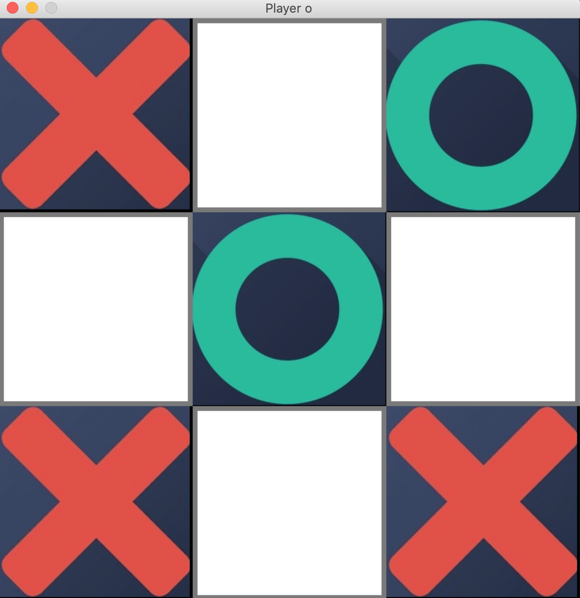

# Tic-Tac-Toe GAME

### 1. FIRST OF ALL
```pip install -r requirements.txt```

### 2. HOW TO PLAY?
```python3 play.py```

In the main window user need to decide what kind of mark wants to use (X or O).


Then user will play with computer.
Have fun :D



### 3. TESTING 
```python3 -m pytest tests/```
